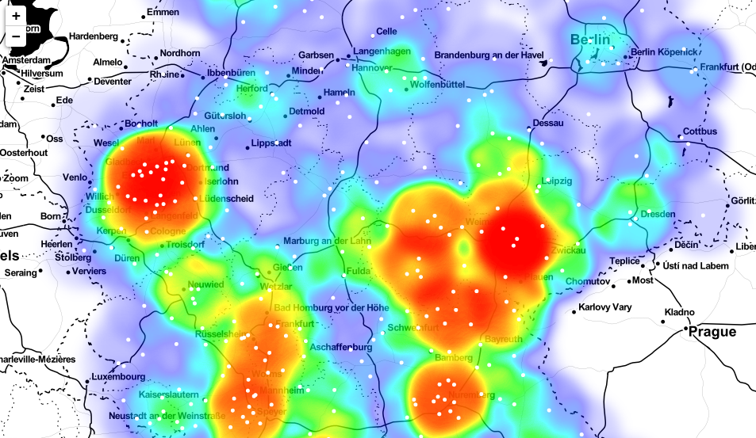

# Germany COVID-19 Tracker

The *Germany COVID-19 Tracker* is a Flask web application that tracks the 7-day cases per 100k 
inhabitants. The data is sourced from the Robert Koch Institute.
The live app can be found here:

https://germany-covid19-tracker.herokuapp.com/



## Requirements

You need Python 3.6 or later to run the tracker.
In Ubuntu, Mint and Debian you can install Python 3 like this:

```bash
sudo apt install python3 python3-pip
```

For other Linux flavors, macOS and Windows, packages are available at

https://www.python.org/getit/

Now you need to install some python libraries:

```bash
pip install -r requirements.txt
```

## Usage

```bash
python app.py
```

In the output you will see a message with a local host address as such:
```bash
* Running on http://127.0.0.1:5000/
```
Open a web browser at the given address.
